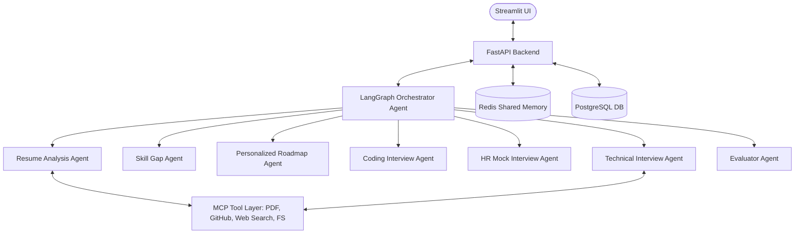

# AI Placement Preparation Platform

A production-ready, multi-agent placement mentor platform designed to guide students through coding prep, resume evaluations, and mock HR/technical interviews.

## 🏛️ System Architecture

The system coordinates specialized agents using a LangGraph state coordinator, caching memories in Redis, and persisting structured data in PostgreSQL:



---

## 🛠️ Technology Stack
* **Backend**: Python 3.12, FastAPI, SQLAlchemy, Alembic, Pydantic, python-jose, LangGraph, langchain-openai, MCP SDK
* **Frontend**: Streamlit, Plotly
* **Memory & Storage**: Redis (caching, history, state checkpoints), PostgreSQL (relational tables)
* **Environment**: Docker, Docker Compose

---

## 🚀 Getting Started & Execution

### Prerequisites
* Docker and Docker Compose installed.
* An OpenAI API Key (Optional; fallback mocks are automatically triggered if not configured).

### One-Command Startup
To start the database, caching layer, FastAPI backend, and Streamlit frontend in a unified docker environment:
```bash
docker-compose up --build
```

Access points:
* **Streamlit UI**: `http://localhost:8501`
* **FastAPI Backend Swagger Docs**: `http://localhost:8000/docs`

---

## 🗄️ Database Schema & Models
The relational model comprises 11 tables handled via SQLAlchemy:
* **students**: Core profile and credentials (email, targets, password).
* **resumes**: Resume locations, ATS scores, extracted skill arrays.
* **skill_gaps**: Target competency requirements and prioritized lists.
* **study_plans**: Weekly and daily preparation tasks checklists.
* **coding_progress**: Total solved coding tasks and topics accuracy.
* **mock_interviews**: Interactive mock logs, scoring, strengths, and weaknesses.
* **readiness_scores**: Overall readiness indices computed daily.
* **github_projects**: Analyzed repositories and stars.
* **learning_resources**: Study materials suggested by the planner agent.
* **notifications**: User system alerts.
* **agent_logs**: Execution logs tracking agent chains.

---

## 🧪 Testing

To run the automated pytest suite locally:
```bash
pip install -r requirements.txt
pytest backend/tests/
```
